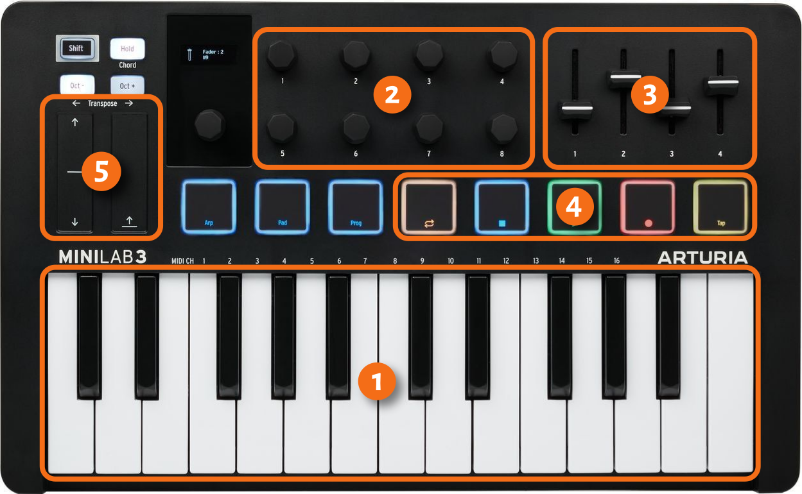
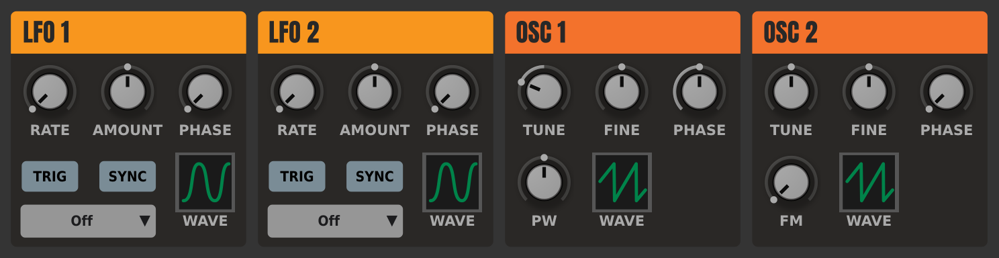
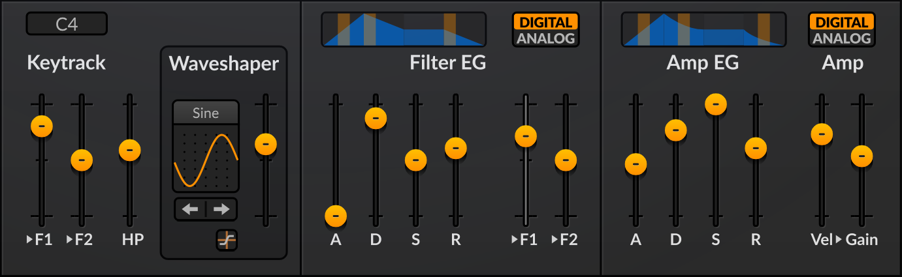
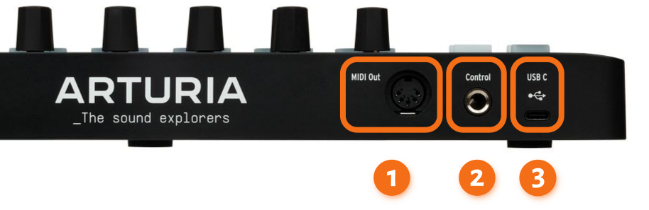

Le MIDI est une technologie cruciale pour l'écriture et la production de musique depuis plus de 40 ans. Cependant, les nouveaux utilisateurs ont encore du mal à comprendre comment cela fonctionne. Ce chapitre donne brièvement un aperçu des bases du MIDI qu'il est important de connaître pour utiliser efficacement Ardour.

Ce chapitre peut sembler un peu écrasant sans avoir d'abord un peu de pratique, alors n'hésitez pas à y revenir et à le relire lorsque vous arriverez à l'enregistrement MIDI.

## Qu'est ce que c'est le MIDI ?

MIDI (Musical Instrument Digital Interface) est un protocole de communication qui permet aux instruments de musique électroniques, aux ordinateurs et à d'autres appareils d'échanger des informations. Plutôt que d'envoyer de l'audio, il envoie des messages ou des instructions.

## Où vous pouvez rencontrer le MIDI

Le MIDI est à peu près partout dans la production musicale.

Les claviers MIDI et les contrôleurs de grille comme Launchpad envoient généralement des messages MIDI aux synthétiseurs matériels et aux stations de travail audio numériques.

Le téléchargement d'un pré réglage à partir d'un éditeur de bureau vers un processeur multi-effets de guitare implique généralement l'envoi d'un message MIDI SysEx.

## Comment MIDI fonctionne-t-il

La chose la plus importante à comprendre est que les claviers MIDI ne font aucun son. Ce qu'ils font, c'est envoyer des instructions que le matériel ou le logiciel peut interpréter pour créer un son ou changer le son ou faire quelque chose de complètement différent.

La plupart du temps, vous traiterez du MIDI en vous enregistrant en jouant sur un clavier MIDI.

Considérez ce clavier :

1. **Keybed**. Chaque fois que vous appuyez sur une touche blanche ou noire, le clavier envoie une commande `NOTE ON`  et mentionne la note qui doit commencer à jouer. Chaque fois que vous relâchez la touche, le clavier envoie une commande `NOTE OFF`  et mentionne les mêmes informations sur la note et le canal.

2. **Encoders**. Il s'agit de boutons rotatifs généralement utilisés pour contrôler divers paramètres des synthétiseurs matériels et logiciels. La plupart du temps, vous les utiliserez pour des commandes de synthétiseur logiciel comme celles-ci :

Les encodeurs peuvent avoir des limites physiques minimales et maximales qui vous empêchent de les faire pivoter davantage ; Ceux-ci sont généralement appelés encodeurs absolus. Mais les encodeurs sans fin, ceux qui n'ont pas de telles limites physiques, sont devenus la norme ces derniers temps.

Lorsque vous tournez un encodeur dans le sens des aiguilles d'une montre ou dans le sens inverse des aiguilles d'une montre, le clavier MIDI envoie un type différent de message appelé `Control Change` ou `CC`. Les messages CC ont des numéros qui les identifient, par exemple `CC21`. Ils contiennent également une nouvelle valeur que l'encodeur envoie.

3. **Atténuateurs**. Contrairement aux encodeurs, les atténuateurs ont toujours une limite physique pour la valeur minimale et maximale. Ils sont généralement utilisés pour contrôler la table de mixage d'une station de travail audio numérique ou des commandes comme ADSR dans les synthés et les échantillonneurs :

Comme les encodeurs, les atténuateurs envoient des messages CC.

4. **Contrôle du transport**. Ces boutons permettent d'activer ou de désactiver la lecture et l'enregistrement dans les stations de travail audio numériques et d'effectuer diverses autres opérations telles que l'avance rapide, le retour au début ou le basculement du mode de lecture en boucle. Pour ce faire, ils envoient également des messages CC.

5. **Pitch bend** et contrôle de **Modulation**. 

## Comment les messages MIDI sont-ils envoyés

Jetons un coup d'œil au panneau arrière du même clavier :

Ce que vous y voyez dépend du fournisseur et du modèle, mais l'idée générale est que le clavier MIDI peut envoyer des messages via les ports MIDI OUT (**1**) et USB (**3**).

Le port MIDI OUT est généralement utilisé pour connecter le clavier directement à un synthétiseur matériel ou à un échantillonneur. Vous pouvez également le connecter au port MIDI IN de votre interface audio s'il en possède un.

Le port USB est généralement utilisé pour connecter le clavier directement à un ordinateur.

Le port de contrôle (**2**) sur le panneau arrière ci-dessus est généralement utilisé pour connecter une pédale de sustain (`CC64`) ou d'expression (`CC11`). Les messages provenant de la pédale de sustain et de la pédale d'expression sont transmis à la station de travail audio numérique via une sortie MIDI ou un port USB.

## Comment Ardour joue du MIDI

Si les claviers MIDI ne font pas de sons, qui le fait?

Sauf indication contraire de votre part, Ardour créera chaque nouvelle piste MIDI avec un synthétiseur virtuel ajouté automatiquement. Cela signifie que vous entendrez toujours les instructions de traitement de la piste MIDI à partir de l'entrée (comme votre clavier MIDI) ou de la piste MIDI et du son en cours de lecture.

## Que sont les canaux MIDI ?

Un dernier concept que vous devez apprendre ici est celui des canaux MIDI. Considérez cette configuration. Vous disposez d'un clavier MIDI connecté à un synthétiseur matériel. Le synthétiseur peut stocker des préréglages, ou patchs, chacun produisant un son unique. En tant que synthétiseur à plusieurs voix, il peut jouer différents sons en même temps, par exemple une basse et une partie principale simultanément. Pour ce faire, il attend des instructions pour chaque patch provenant séparément, via des chemins indépendants appelés canaux MIDI.

## Lectures complémentaires

Si vous voulez savoir comment utiliser efficacement le matériel MIDI avec Ardour, veuillez lire le chapitre [Périphériques MIDI](/using-your-gear/midi-devices).

**Poursuivre**

Dans le chapitre suivant, nous lancerons Ardour sur Ubuntu Linux et apprendrons les bases de l'interface utilisateur.
