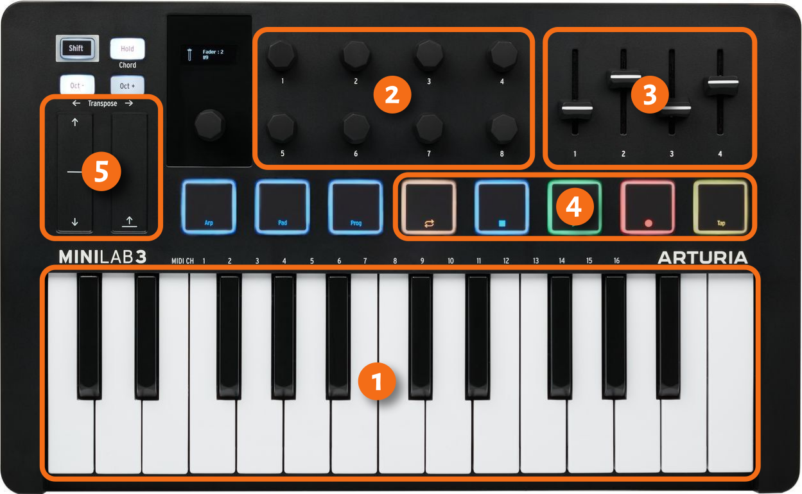
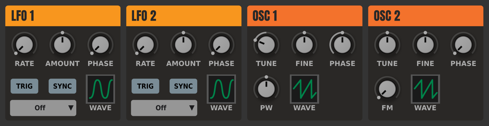
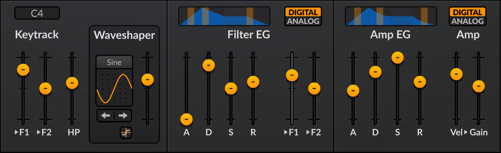
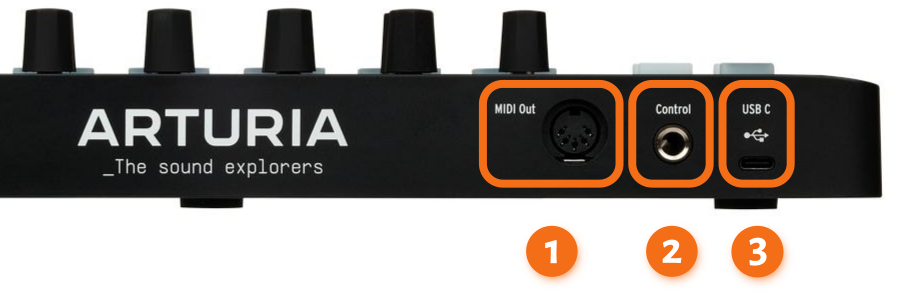

MIDI has been a crucial technology for songwriting and producing music for over 40 years. However, new users still struggle understanding how it works. This chapter briefly overviews the basics of MIDI that are important to know to use Ardour efficiently.

This chapter may seem a little overwhelming without getting some practice first, so please feel free to get back and give it another read when you get to recording MIDI.

## What is MIDI?

MIDI (Musical Instrument Digital Interface) is a communication protocol that allows electronic musical instruments, computers, and other devices to exchange information. Rather than sending audio, it sends messages, or instructions.

## Where you can come across MIDI

MIDI is pretty much everywhere in music production.

MIDI keyboards and grid controllers like Launchpad commonly send MIDI messages to hardware synthesizers and digital audio workstations.

Uploading a patch from a desktop editor to a guitar multi-FX processor typically involves sending a SysEx MIDI message.

## How MIDI works

The most important thing to understand is that MIDI keyboards do not make any audio whatsoever. What they do is send instructions that hardware or software can interpret to make sound or change the sound or do something else entirely.

Most of the time, you will deal with MIDI by recording yourself playing on a MIDI keyboard.

Here is a typical MIDI keyboard with a minimal set of controls:

1. **Keybed**. Every time you press a white or black key, the keyboard will send a `NOTE ON` command and mention which note should start playing. Every time you release the key, the keyboard will send a `NOTE OFF` command and mention the same information about the note and the channel.

2. **Encoders**. These are rotary buttons typically used to control various parameters of hardware and software synthesizers. Most of the time you will use them for software synthesizer controls like these ones:

Encoders can have physical minimum and maximum limits that prevent you from rotating them any further; these are usually called absolute encoders. But endless encoders, the ones that have no such physical limits, have been becoming the norm lately.

When you rotate an encoder clockwise or counter-clockwise, the MIDI keyboard sends a different type of a message known as `Control Change`, or `CC`. CC messages have numbers that identify them, e.g. `CC21`. The also contain a new value that the encoder sends. 

3. **Faders**. Unlike encoders, faders always have a physical limit for minimum and maximum value. They are typically used to control the mixer in a digital audio workstation or controls like ADSR in synths and samplers:

Just like encoders, faders send CC messages.

4. **Transport controls**. These buttons toggle playback and recording in digital audio workstations and do various other things like fast-forwarding, going back to the beginning, or toggling looped playback mode. To do that, they also send CC messages.

5. **Pitch bend** and **Modulation** controls. 

## How MIDI messages are sent

Let's take a look at the back panel of the same keyboard:

What you see there depends on the the vendor and model, but the general idea is that MIDI keyboard can send messages via MIDI OUT (**1**) and USB (**3**) ports.

The MIDI OUT port is typically used to attach the keyboard directly to a hardware synth or sampler. You can also attach it to your audio interface's MIDI IN port if it has one.

The USB port is typically used to attach the keyboard directly to a computer.

The Control port (**2**) on the rear panel above is typically used to connect a sustain (`CC64`) or an expression (`CC11`) foot pedal. Messages from either the sustain and the expression pedal are transmitted to the digital audio workstation via either MIDI OUT or USB port. 

## How Ardour plays MIDI

If MIDI keyboards don't make sounds, who does?

Unless you specify otherwise, Ardour will create every new MIDI track with a virtual synthesizer automatically added. This mean you will always hear the MIDI track processing instructions from either input (like your MIDI keyboard) or the MIDI track and playing sound.

## What are MIDI channels?

One last concept you need to learn here is MIDI channels. Consider this setup. You have a MIDI keyboard connected to a hardware synthesizer. The synthesizer can store presets, or patches, each producing a unique sound. As a multi-voice synthesizer, it can play different sounds at the same time, e.g. a bass and a lead part simultaneously. To do so, it expects instructions for each patch coming separately, through independent pathways called MIDI channels.

## Further reading

If you want to know how to use MIDI gear efficiently with Ardour, please read the [MIDI devices](/using-your-gear/midi-devices) chapter.

**Continuing**

In the next chapter, we'll launch Ardour on Ubuntu Linux and learn the basics of the user interface.
