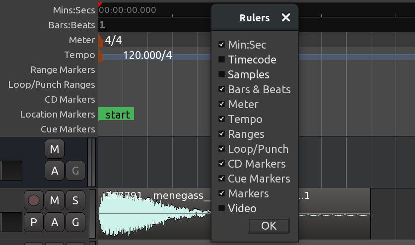

+++
title = "Setting up the meter"
chapter = false
weight = 3
+++

The _meter_, or _time signature_, determines the musical speed of the passage we
are composing and is measured in _beats per bars_.

If we are composing something rhythmic, it will also determine the lengths of
the sound samples we use to some extent. So it is important to be able to set up
the meter before we continue.

To see the meter-related timelines for the session, you can right-click anywhere
in the "header" of the rulers and check the following options: _Meter_, _Bars
& Beats_, and _Tempo_.

 

There is always at least one marker for both the meter and the tempo in the
session, right in the beginning of the timeline. You can change either of the
two further in the session. To do that, you need to pick either time or bar and
beat on the timeline, right-click on the dedicated timeline lane, choose _New
Meter_ or _New Tempo_, and provide a new value in the newly opened dialog.



You can also easily change the latest meter or tempo even if you scrolled past
the point in time where you can see the marker on the timeline. Simply click on
either tempo or TS button right below the secondary clock and provide a new
value in the newly opened dialog.

 

For the tempo (button on the left), choose the number of beats per minute (bpm)
for your session.

For the _meter_ (button on the right; the letters _TS_ on the button mean
_time signature_), you can enter new values for the _beats per bar_ as well as
the _note value_.

## Continuing

Next, we will explore using ranges to set up a loop we can listen to while we
arrange the rhythm.

Next: [USING RANGES](../using-ranges)
