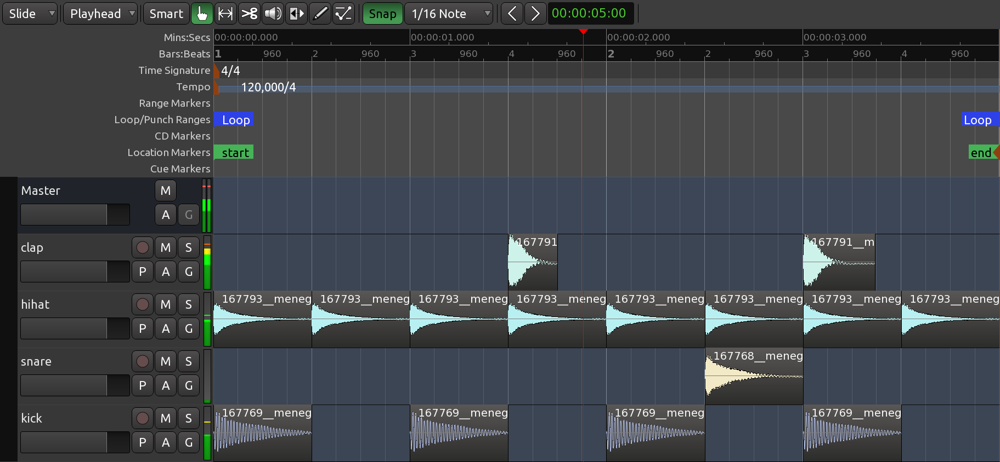

+++
title = "Working with regions"
chapter = false
weight = 5
+++

Sections of audio are called _regions_ in Ardour. To compose the short rhythmic
passage we've been working on, we will need to know how to _select_, _move_,
_split_ and _trim_ these regions, as well as how to _fade in_ or _fade out_
their volume and create _crossfades_ between them. Some of these options may
need to happen at specific _edit points_ in the composition, or according to the
musical _meter_ we can define with the _timeline_ and the _grid_ as well.

## Selecting Regions

The _Grab_ mode (**G** shortcut) is the tool to select and move objects. It is
located just below the transport menu in the _Editor_ window (the little "hand"
icon). You will use this tool a lot in your Ardour work.

 

When it is active, your mouse pointer will look like a little hand icon.

Try all of the operations below, for practice:

- Click on the waveform of the region to select it. Click and drag on a region
to move it around (left and right within the same track, but also up and down
onto other tracks).

- Use **Ctrl+Click** to create and drag around a _copy_ of the region.

- You can select multiple regions by holding the **Shift** key while clicking
on each region you want to select.
    
- You can also drag a selection box over multiple regions to select them all.

 

- Move multiple regions at the same time after selecting them. 

- You can select several sequential regions on one track all at once by holding
down the **Shift** key while selecting the first and the last regions of the
sequence (copy a few regions on the same track to try this out).

- When you select a single region, make sure to click on the waveform section of
its rectangle. The lower stripe with the region name is used for a different
action (see the _Trimming Regions_ section below).
    
- Use the **Del** key to delete selected regions.

- Standard copy (**Ctrl+C**), cut (**Ctrl+X**), and paste (**Ctrl+V**)
operations also work with regions. 

## Moving Regions

While moving a region, a _timecode_ will appear on the screen in yellow numbers.
This timecode is the region's starting point on the timeline. The unit of this
timecode is the same as the unit of the primary clock, which you can change by
right-clicking on the clock and choosing a new unit (_Minutes:Seconds_,
_Bar:Beats_, etc).

You can move regions horizontally (sideways) to a different point in time on the
same track, or you can move the selected region vertically (up or down) to a
different track. 

When a set of one or more regions is selected, you can move the whole set by
dragging with the mouse.

{}
Make sure to select the region in its waveform section, because selecting the
bottom title bar area is used for a different action (see _Trimming Regions_
below).
{}

## Duplicating Regions

In addition to **Ctrl+Click+Drag** and standard copy/paste, Ardour offers
other handy ways to duplicate regions. Use the _Grab_ mode (select/move
objects) to select one or more regions, then use the _Duplicate_ function to
make one or more copies (menu `Regions > Duplicate`). Three options are
available:

- _Duplicate_ (shortcut **Alt+D**): make a copy of the selected region on
the same track, immediately after the original.

- _Multi-Duplicate_ (shortcut **Shift+D**): make multiple copies of the
selected region at once (same track, in sequence). You can specify the number
of duplications.

- _Fill Track_: make as many copies of the selected region as needed to fill
the entire track, all the way up to the _End_ marker on the timeline. 

In the following screenshot, regions have been duplicated using the methods
above.

 

## Using Edit Points

When you use the standard copy/cut/paste commands, where exactly will the
regions be pasted? The exact location is determined by the edit point
drop-down menu.

 

If _Mouse_ is selected as the edit point, the copied region will be pasted at
the current position of the mouse.

If _Playhead_ is selected as the edit point, the copied region will be pasted
at the red playhead line on the same track where the original region is.

Finally, if _Marker_ is selected as the edit point, then the copied region
will be pasted immediately after the currently selected _location marker_.

## Markers

It is very useful to be able to tag different locations in a session for later
use when editing and mixing. Ardour supports several ways for doing this. The
most common method is using _location markers_, which define specific positions
in time. 
 
Location markers can be added to the timeline by right-clicking on the
_Location Markers_ strip and selecting _Add New Location Marker_. If you don't
see the _Location Markers_ strip, right-click on the timeline and select it to
make it visible. Location markers can also be selected with the mouse and
moved to new positions. Right-clicking on a location marker lets you rename
the marker, among other options. 

 

{}
When you first create a new session, two location markers are automatically
added by default. These are the _start_ and _end_ markers that you see in
the screenshot above. If you don't see the _end_ marker, zoom out enough and
you will find it. 
{}

## Splitting Regions

To _split_ a region simply means to divide a single region into two independent
regions. There are two ways of accomplishing this:

* You can use the _Cut_ mode (**C** shortcut) to point and click anywhere you
want to split; or

* You can stay in the _Grab_ mode and use the **S** shortcut (for "Split").
In this last case, the point at which a region will be split depends on the
currently selected edit point. If _Mouse_ is selected as your current edit
point, select a region and place the cursor at the point you would like to
_Split_, then type **S**" (same as going to menu `Edit > Split Region`).

After being split, the original single region becomes two independent regions, 
with a new name for each, as in the image above. The two new regions are now 
entirely independent. You can move and edit them separately.

Regions can also be split by using the playhead or a marker as the edit point. 

The split regions will receive a name derived from the original name of its
parent region, and you will see this reflected in your regions list. For
example, in the image above, you see two regions called _pink.15_ and _pink.16_,
which means there were split from a parent region called "pink" (not shown in
image).

{}
Splitting ranges will follow your grid settings. For example, if you have an
active grid set for bars, splits will happen at the bar boundaries. If you
choose _No Grid_, splits will happen wherever the edit point is, regardless of
any grid.
{}

## Trimming Regions

If you move the cursor near the left or right side edge of a region, you will
see that the pointer becomes an arrow. Click and drag inwards from either end
of the region, and the region will be shortened accordingly. This is called
_trimming_ the region. Regions can be trimmed from the start of the region
(drag from left to right at the edge) or from the end (drag from right to
left).

This action is non-destructive: no audio is actually being deleted. It is as
if you were just "hiding" those portions of the region that you don't want or
don't need anymore. Later on, you can "un-trim" the region (i.e., extend it
back to its original full size), even if it has been moved or copied to a new
track.

{}
Like splitting, trimming will obey grid settings. If you don't want your
trimming to be constrained to any grid, simply turn the grid off (_No Grid_).
{}

## Deleted Regions

Because Ardour is non-destructive, the regions you have deleted from tracks
are not completely removed from the session. They can always be accessed again
from the region list on the far right side of the _Editor_ window (Regions can
be dragged from the list onto any tracks).

## Creating Fades in Regions

A _fade_ is a change in the volume of a region, either as the region starts or
as it ends. A fade at the start of the region is a _fade in_, and at the end
of a region it is a _fade out_. Each region has two small handles along the
top corners, which can be dragged inwards from either edge to create a fade in
or fade out. The screenshot below shows a fade in (indicated by the shaded
area). 

 

In fact, every region has a fade in and fade out built-in. By default, the
region fade is very short and serves to avoid clicks in the transitions at
the start and end of the region. By adjusting the regions fade length as shown
above, a more gradual transition can be accomplished.

By right-clicking on one of the fades (the shaded area), the speed of the fade
can also be adjusted.

 

## Crossfading Between Two Regions

When one region fades out while another fades in, this is called a
_crossfade_. If the two regions are in different tracks, you can use the
method described above with the fade in and fade out handles. The following
screenshot shows an example. 

 

However, if both regions are in the same track, you need to overlap them in
order to create a crossfade. When regions overlap on the same track, Ardour
treats them as *layers*, that is, one of the regions is considered to be on
top of the other. The important rule to understand is:

*The fade in (or fade out) of the topmost region represents the crossfade
between the two regions.*

Once you understand this principle, it's easy to create and control crossfades
between regions. Here's an example. The two separate regions seen below will
be made to overlap in order to create a crossfade.

 

Note that we did not add any extra fade out to the first region, but we did
add a longer fade in to the second region. Then we drag the second region
partly on top of the first:

 

The fade in of the second region works now as the crossfade between the two
regions. In other words, the first region will fade out in a mirror image way
as the second region fades in.

In order for this to work, though, we need to make sure that the region that
has the desired fade is *on top* in Ardour's layering system. In order to
change layering of regions, select a region and go to the menu `Region >
Layering`. 

 

The difference may be hard to hear if you are doing this with the very short
percussive sounds we imported earlier. To really hear the effect, import a
couple of longer samples to try it out (for example, a sample of rain sounds,
and another of a human voice). Overlap several seconds of your long samples on
the same track. You will hear the difference as you move the second region to
the bottom (_Lower to Bottom_), and then back to top (_Raise to Top_). When
it's on top, we will hear the desired crossfade. When it's at the bottom, we
will hear no crossfade, just an abrupt change from first to second region
(assuming your first region has no fade out specified, as in the screenshots
above).

## Using Grid Settings

Experiment with the _Grid Mode_ setting, as discussed in the _Setting Up the
Timeline_ chapter, to give different kinds of quantization — in other
words, to constrain the boundaries of each region to certain grid points.
Here, the grid has been activated and set to _Beats/16_, to quantize the
regions to sixteenth notes within each bar. You may wish to trim the endpoints
of some of the samples, as discussed above, to fit within the metric structure
you have set up.

 

## Continuing

In the next chapter, we will explore a few more things you can do with regions

Next: [FURTHER REGION OPERATIONS](../further-region-operations)
