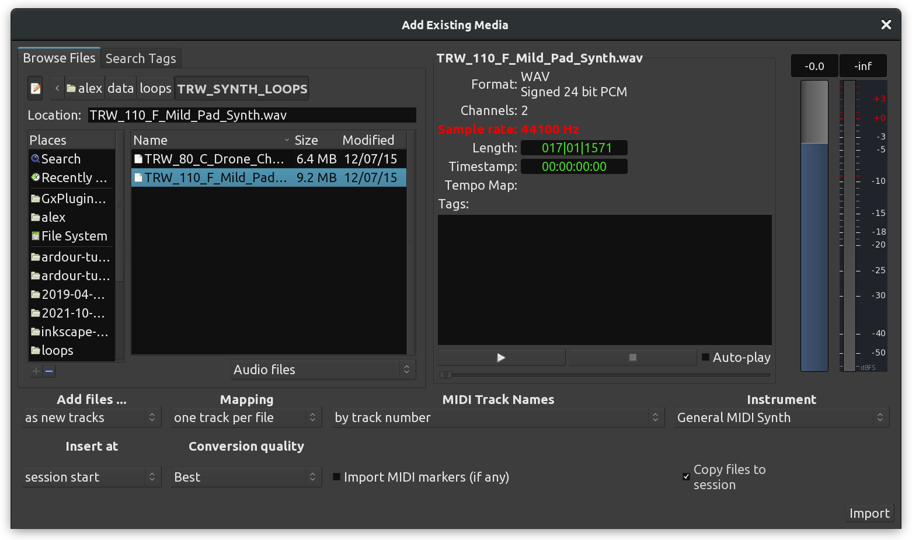

+++
title = "Importing audio"
description = "Importing audio to Ardour tracks"
chapter = false
weight = 4
#pre = "<b>1. </b>"
+++

Sections of audio are known as _regions_ in Ardour. A Region can be an entire
sound file or a portion of it. Here you will learn how to import audio files
from the hard drive of your computer so they can be used in your Ardour session.

To import an audio file into your session, you will use the _Add Existing Media_
 dialog. Use the shortcut **Ctrl+I** to get to this window, or alternatively go
to the `Session > Import` menu).

On the left side of this dialog you will see a file browser which allows you to
search your hard drive for appropriate sound files to add (preferably, start
with a common file format, such as WAV or AIFF).

 

At the lower left corner there is a menu which indicates how these files will
be added. _Add files… as new tracks_ will import audio files and place them on
a newly created track. _Add files… to source list_ will simply import audio
files into the Sources list, without creating any new tracks. Choose this
option now, as we don't want Ardour to create any tracks at this point. Make
sure the _Mapping_ options says _one region per file_.

 

{}
If you do not have any suitable audio files on your hard drive to follow these
steps, visit [freesound.org](http://www.freesound.org/)), where you can find a
large collection of Public Domain and Creative Commons–licensed samples in a
variety of sample rates and formats.
{}

On the right side of the _Add Existing Media_ dialog you will see a section
allowing you to inspect the properties of the file you selected. Here you will
see the name, number of channels, sample rate, format and length of the sound
file, along with any tags you have chosen to add to the file.

The **Play** button allows you to preview the file. You can also select
**Auto-play** if you would like to hear a sound file immediately as soon as you
click on it in the file browser (without having to push the Play button).

You will notice that the option _Copy files to session_ is checked by default.
This will make a copy of the imported file(s) into the folder of the current
session. This is safer, but it uses more disk space. If you uncheck this option
(not recommended!), Ardour will use the sound file from its current location on
the hard drive. In this case, if the file is moved to a new location on the hard
drive, you will run into trouble, because Ardour won't be able to find it the
next time you open this session. **It is highly recommended that you leave this
box checked (_Copy files to session_)**. 

Click **OK** to proceed.

{}
The file(s) you have imported will appear listed in your _Sources_ list. This
list is located at the far right of the editor window. If you don't see it,
make sure _Show Editor List_ is checked under the _View_ menu.
{}

 

By dragging and dropping an audio file listed on the _Sources_ list onto the
main canvas, you can insert it in an existing or new track. If you drag it into
an existing track, it will be added there. If you drag onto the empty space
beneath existing tracks, a new track will be automatically created to
accommodate it.

Release the mouse button to complete the drag-and-drop operation. A new region
will be inserted at the exact time point where you dropped it.

{}
If a sound file is selected in the Editor List (i.e., if it is highlighted in
blue), the next time you click on that file name, Ardour will think you are
trying to rename the region (the name will become editable). More likely you
were just trying to click to drag and drop the file onto a track. In order to
click and drag a previously _highlighted_ region from the list, you need to
point and click in the empty space right before or after the name.
{}

Important: always make sure you are placing stereo regions on stereo tracks. If
you drag a stereo file onto a mono audio track, only the left channel will be
used. In the screenshot below, a stereo file with very distinct left and right
channels was dragged onto a stereo track and a nono track. Notice that in the
mono track only the left channel is displayed (and played back).  

 

### Importing Audio Directly to a Track

As mentioned earlier, the _Add existing media_ dialog also allows you to import
audio files directly onto tracks.

Choose _Add files… as new tracks_ to automatically create a new track and add
the selected file to it. The track will be named after the sound file name.

 

If you have previously selected one or more tracks, the menu will display the
additional option _Add files… to selected tracks_ to add a sound file into the
already existing selected track.

When adding files as new tracks, note that the _Mapping_ options lets you choose
between _one track per channel_ and _one track per file_. For the purpose of
this tutorial, choose _one track per file_, otherwise the left and right
channels of a stereo file will be split into two separate tracks.

#### Choose Insert Point

When using either one of the options above (_add as new track_ or _add to
selected tracks_), you should also specify where in the track you want the new
region to be placed. In the screenshot below, we are choosing _session start_.

 

The region appears in a new track in the session. The new track automatically
receives the name of the imported sound file.

The sound file will also appear in the _Regions_ list so that it can be inserted
into other tracks as well by dragging and dropping it.

### Remove Regions from Tracks

To remove a region from a track, you can select it with the mouse and use the
*Cut* function from the menu, the **Control** (or **Apple**) key and the **X**
key, the **Delete** key or the key combination of **Fn + Backspace** (which is
used, for example, on a laptop keyboard that does not have a proper **Delete**
key).

{}
**Save your work often!** The shortcut **Control + S** is your friend. Use it
a lot, all the time.
{}

## Continuing

Now that you have some material in your session, you might want customizing the
timeline to better suit your needs or jump to recording new material live.

Next: [Setting up the timeline](../setting-up-the-timeline) or
[Recording audio](../../recording-audio)
