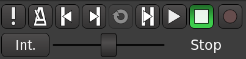

+++
title = "Overview of the Interface"
description = "Basics of Ardour's user interface"
weight = 2
#pre = "<b>1. </b>"
+++

This section will give you a basic overview of Ardour's user interface.

We will take a look at shared elements of the interface, main windows, and focus on the _Editor_ window and the _Mixer_ window. Later chapters will give more detailed information on each feature listed here.

TODO PARTS OF UI ANNOTATED SCREENSHOT

### Transport Menu

The **Transport Menu** controls include the following buttons:

- MIDI Panic
- Enable/Disable audio click (metronome)
- Rewind
- Fast forward
- Loop playback
- Play range/selection
- Play from playhead
- Stop
- Record-enable 
- Jog/shuttle controls

### Clocks

 
The main **Clocks** are located next to the transport controls. Clocks
in Ardour can display time in 4 different formats: Time Code,
Bars:Beats, Minutes:Seconds, and Samples. Right-click on the clock to
select a format. You can also turn the clock off. The reason for having
two transport clocks is that it allows you to see the playhead position
in two different time units without having to change any settings.

Please see the [**Setting Up the Timeline**](../setting-up-the-timeline) chapter for more details on the
Clocks.

## Switching Between Windows

You can use the key combination **Alt + M** (**Control + M** on a
Mac) in order to toggle which window is on top: Editor or Mixer.

## Continuing

The next sections will explain basics of main Ardour's windows:

- Editor
- Mixer
- Recorder
- Cue
