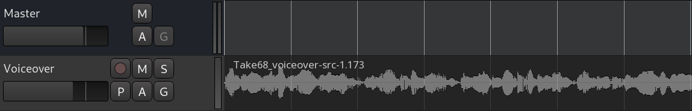
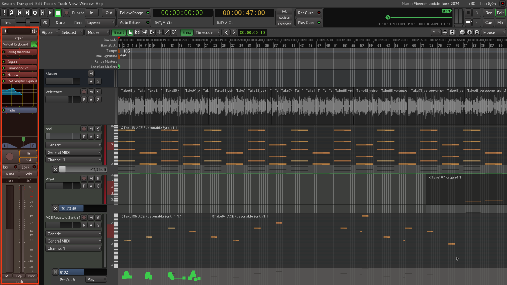

+++
title = "Editor window"
description = "Basics of Ardour's editor window"
chapter = false
weight = 1
#pre = "<b>1. </b>"
+++

When you create a new session, Ardour opens an empty new window called the
_Editor_ window. The _Editor_ window is the most important window in Ardour, as
this is how you will control the program as well as see and edit the audio and
MIDI data you have recorded or imported.

Let's take a look at main parts of the Editor window:



Here they are:

1. Editor-specific toolbar
2. Timeline
3. Tracks and busses
4. Project overview
5. Editor mixer strip
6. Regions, Tracks/Busses, Snapshots, Groups, Ranges, Marks

Let's overview them quickly.

## Editor-specific toolbar

### Edit Modes and Cursor Modes

TODO RIPPLE ALL + MODES

The **Edit Modes** and **Cursor Modes** controls define the behavior of the main
canvas and the different functions the cursor can have. There are three Edit
modes in the drop-down menu: **Slide**, **Ripple**, and **Lock**. To the right
of the Smart button are the Cursor Modes:

- _Smart_ mode (shortcut **Y**)
- _Grab_ mode (shortcut **G**)
- _Range_ mode (shortcut **R**)
- _Cut_ mode (shortcut **C**)
- _Stretch_ mode (shortcut **T**)
- _Audition_ mode
- _Draw_ mode (shortcut **D**)
- _Internal Edit_ mode (shortcut **E**)

Most of them are discussed in the [Working With
Regions]](en/editing-sessions/working-with-regions/) chapter. The last two are
discussed in the **Using Automation** chapter.

The **Smart Mode** is actually a combination of Grab Mode and Range Mode. When
enabled, the mouse behaves as if it is in "Range Mode" in the upper half of a
region, and in "Grab Mode" in the lower half.

### Snap Options

The **Snap Options** menu controls the **Grid**, **Grid Points** and
**Edit Point**. Please see the chapters on **Setting Up the Meter**,
**Using Ranges** and **Working With Regions** for more details.

### Zoom Options

In between **Cursor Modes** and **Snap Options** are the **Zoom
Options**. Here you can define the behavior of zooming operations. You
have standard **Zoom In** and **Zoom Out** buttons, plus a third called
**Zoom to Session** (useful for having a quick overview of your entire
session: it zooms it to fit the available space on the screen).

{}
Use the shortcuts **=** (the equal sign on your main keyboard) for zooming, and
**-** (the dash key on your main keyboard) for zooming out.
{}

The drop-down menu controls the **Zoom Focus**. It defines the focus
point of zooming operations. Try zooming in and out
with a different Zoom Focus each time. For example, choosing Playhead
will cause zoom to behave in relation to the position of the
Playhead. Mouse will take your current mouse position as the reference,
and so on.

The following drop-down menu and the last two buttons control "vertical zoom." They allow you to
expand and shrink all tracks and busses vertically. Use the drop-down menu to choose a specific number of tracks you want to fit on the screen. Use the buttons to shrink or expand all tracks (or only selected tracks, if a selection is made).

### Auxiliary Controls

For further information on other buttons and displays on the main
interface, please refer to the [Ardour Manual](http://manual.ardour.org/ "Ardour Manual").

## Timeline

Right-click on the names of rulers and you will see a menu with all the
possible rulers at your disposition. You may uncheck rulers that you
don't need in order to save screen space. More information on these
operations can be found in the **Setting up the Timeline** and **Setting
up the Meter** chapters.

## Tracks and Busses

Just below the Rulers is where Tracks and Busses are displayed. In the
example below, you can see one Bus called "*Master*" and one Track
called "*MyTrack*". MyTrack also contains one region, which
represents an audio file with a drawing of its waveform. More
information on Tracks and Busses can be found in the **Creating a Track
or Bus** chapter.

## Project Overview

TODO

## Editor Mixer

The Editor Mixer is located at the left of the Edit Window. It displays
the **Mixer Strip** of the currently selected Track or Bus. It controls
the volume, Plugins and Routing for the Track or Bus to which it
corresponds. You can toggle to view or hide the Editor Mixer by clicking
on the menu *View* > *Show Editor Mixer* (shortcut *"Shift"* + *"E"*).
This Mixer is covered in the **Using the Mixer Strip** chapter.

## Regions, Tracks/Busses, Snapshots, Groups, Ranges, Marks

The space on the right of Ardour's Editor Window can have 5 different
functions, depending on which tab is currently selected: **Regions**,
**Tracks/Busses**, **Snapshots**, **Track & Bus Groups**, and **Ranges
and Marks**. Regions is the tab selected by default. This part of the
Editor Window is commonly referred to as **Regions List**. Regions
represent audio files stored on the hard drive which can be dragged from
the Regions List directly onto a track in the main canvas. More
information on Regions can be found in the **Working With Regions**
chapter. The Tracks tab is covered in the **Arranging Tracks** chapter,
and Snapshots are discussed in the **Saving Snapshots** chapter.

## Continuing

Next up is the _Mixer_ window where you control...

Next: [Mixer window](../mixer-window)