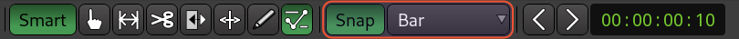
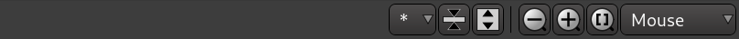

+++
title = "Editor window"
description = "Basics of Ardour's editor window"
chapter = false
weight = 1
#pre = "<b>1. </b>"
+++

When you create a new session, Ardour opens an empty new window called the
_Editor_ window. The _Editor_ window is the most important window in Ardour, as
this is where you arrange track, import and edit media on the timeline, and
control plugin automation for creative effects and mixing.

Let's take a look at main parts of the _Editor_ window:



Here they are:

1. Editor-specific toolbar
2. Timeline
3. Tracks and busses
4. Project overview
5. Editor mixer strip
6. Regions, Tracks/Busses, Snapshots, Groups, Ranges, Marks

Let's overview them quickly.

## Editor-specific toolbar

### Edit Modes and Cursor Modes

The _Edit Modes_ and _Cursor Modes_ controls define the behavior of the main
canvas and the different functions the cursor can have. There are three edit
modes in the drop-down menu: _Slide_, _Ripple_, and _Lock_. We will discuss them
in the [Editing sessions](../../../editing-sessions/) chapter.

To the right of the **Smart** button are the _Cursor Modes_:

- _Smart_ mode (**Y** shortcut)
- _Grab_ mode (**G** shortcut)
- _Range_ mode (**R** shortcut)
- _Cut_ mode (**C** shortcut)
- _Stretch_ mode (**T** shortcut)
- _Audition_ mode
- _Draw_ mode (**D** shortcut)
- _Internal Edit_ mode (**E** shortcut)

Most of them are discussed in the [Working With
Regions](../../../editing-sessions/working-with-regions/) section. The last two are
discussed in the **Using Automation** chapter.

The _Smart_ mode is actually a combination of _Grab_ mode and _Range_ mode. When
enabled, the mouse behaves as if it is in _Range_ mode in the upper half of a
region, and in _Grab_ mode in the lower half.

### Snap Options

The _Snap Options_ toolbar allows selecting visible grid units that affect
snapping when editing regions and, in case of MIDI regions, their contents.
Please see the sections on
[Setting Up the Meter](../../../editing-sessions/setting-up-the-meter/),
[Using Ranges](../../../editing-sessions/using-ranges/) and
[Working With Regions](../../../editing-sessions/working-with-regions/) for more
details.

### Track View and Zoom Options

The far right part of the toolbar has track view and zoom options.

Track view options allow selecxting how many tracks to display at the same time,
and you can also shrink or expand the vertical zoom of selected tracks and
busses.

Zoom options allow incrementally zooming in and out, as well as zooming out to
show the entire project horizontally.

{}
Use the shortcuts **=** (the equal sign on your main keyboard) for zooming, and
**-** (the dash key on your main keyboard) for zooming out.
{}

The drop-down menu controls the _zoom focus_. It defines the focus point of
zooming operations. Try zooming in and out with a different zoom focus each
time. For example, choosing _Playhead_ will cause zoom to behave in relation to
the position of the _Playhead_. _Mouse_ will take your current mouse position as
the reference, and so on.

## Timeline

Right-click on the names of rulers and you will see a menu with all the
possible rulers at your disposition. You may uncheck rulers that you
don't need in order to save screen space. More information on these
operations can be found in the
[Setting up the Timeline](../../setting-up-the-timeline/) and
[Setting Up the Meter](../../../editing-sessions/setting-up-the-meter/) chapters.

## Tracks and Busses

Just below the rulers is where tracks and busses are displayed. In the example
below, you can see one bus called _Master_ and one track called _MyTrack_.
_MyTrack_ also contains one region which represents an audio file with a drawing
of its waveform. More information on tracks and busses can be found in the
[Creating a Track or Bus](../../creating-tracks-and-busses/) chapter.

## Project Overview

This is a bird's-eye view of the entire session.



 There are two major use cases
here:

1. Navigating around the project. Just grab the rectangle and drag it around to
pan over the entire project.

2. Tweaking zoom and position of the visible part of the project. Grab any part
of the visible rectangle's border and drag it inwards or outwards to zoom in or
out respectively.

## Editor Mixer

The Editor Mixer is located at the left of the Edit Window. It displays
the **Mixer Strip** of the currently selected Track or Bus. It controls
the volume, Plugins and Routing for the Track or Bus to which it
corresponds. You can toggle to view or hide the Editor Mixer by clicking
on the menu *View* > *Show Editor Mixer* (shortcut *"Shift"* + *"E"*).
This Mixer is covered in the **Using the Mixer Strip** chapter.



## Regions, Tracks/Busses, Snapshots, Groups, Ranges, Marks

The space on the right of Ardour's Editor Window can have 5 different
functions, depending on which tab is currently selected: **Regions**,
**Tracks/Busses**, **Snapshots**, **Track & Bus Groups**, and **Ranges
and Marks**. Regions is the tab selected by default. This part of the
Editor Window is commonly referred to as **Regions List**. Regions
represent audio files stored on the hard drive which can be dragged from
the Regions List directly onto a track in the main canvas. More
information on Regions can be found in the **Working With Regions**
chapter. The Tracks tab is covered in the **Arranging Tracks** chapter,
and Snapshots are discussed in the **Saving Snapshots** chapter.

## Continuing

Next up is the _Mixer_ window where you control...

Next: [Mixer window](../mixer-window)