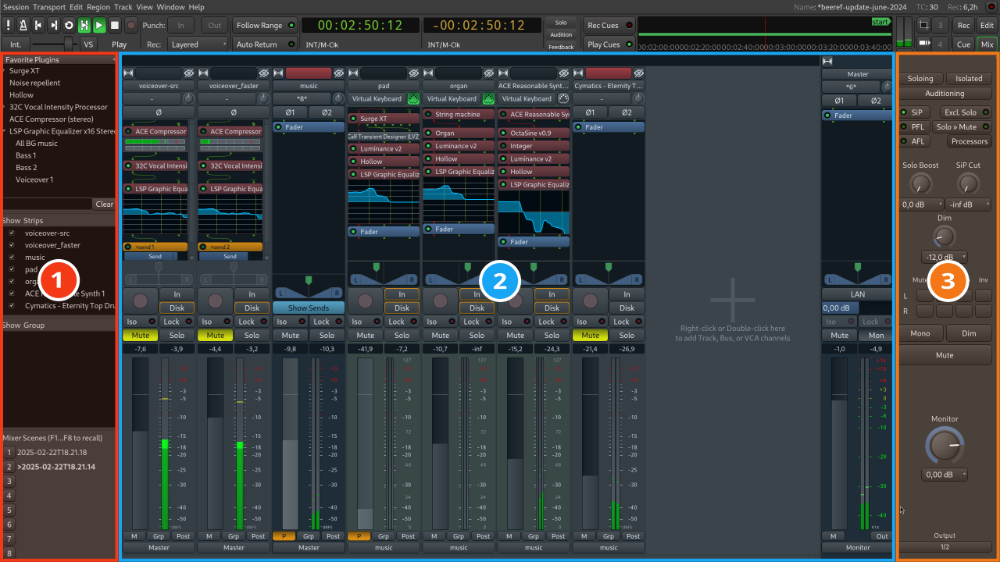

+++
title = "Mixer window"
description = "Basics of Ardour's Mixer window"
chapter = false
weight = 2
#pre = "<b>1. </b>"
+++

The _Mixer_ window, can be viewed by going to the main menu and clicking
`Window > Mixer > Show Mixer`. Alternatively, you can press **Alt+M**.

TODO: not just display mixer strips, but control gain and plugins etc.

The main function of the _Mixer_ window is to display all the mixer strips for
the various tracks and busses side by side for easy reference. This window is
mainly used during the _mixing_ process. It also provides access to plugins and
routing features. See the chapters on [understanding
routing](en/recording-audio/understanding-routing/),
[mixing](en/mixing-sessions/mixing-levels/), and [using
plugins](en/mixing-sessions/using-plugins/) for details.

The _Mixer_ window has 3 larger sections:

1. Left sidebar with a list of favorite plugins, visibility control for mixer
strips, and a track/bus groups manager
2. Mixer strips for tracks and busses, including a master bus that the final
signal usually travels through
3. Optional _Monitor Section_ with features like _Pre/After Fade Listen_,
_Exclusive Solo_ etc.

## Continuing

In the next section we'll take a quick look at the _Recorder_ window that is
streamlined for launching and controlling the recording of multiple tracks at
the same time.

Next: [Cue window](../cue-window)