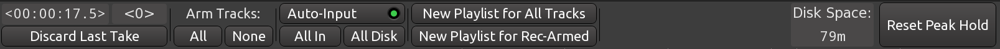

The _Recorder_ window is streamlined for one particular use case: recording to multiple tracks. The interface is pointedly simplified to remove all distraction.

There are three major sections in the Recorder window as outlined above:

1. Window-specific toolbar
2. The timeline and the tracks representation
3. Inputs control

## Window-specific toolbar

The toolbar has specific commands and information: arming and disarming all tracks for recording, discarding the last take, automatically switching all inputs for signal monitoring, estimation of the time you can record to the disk until it's out of free space etc.

## The timeline and the tracks representation

The timeline only displays timecode, and the tracks view has no waveform rendering at all. This helps with the use of system resources when recording dozens of tracks simultaneously.

## Inputs control

The bottom part of the window is where you control inputs: you can both monitor input volume and rename physical ports for convenience. To do the latter, just click on the input port name and give a new name.

E.g. if you have two mic inputs, one for vocal and one for guitar, naming them accordingly will simplify picking the right one for the right track. This will be even more convenient for audio interfaces with e.g. 18 inputs.



**Continuing**

Finally, in the next section we'll take a quick look at the _Cue_ window that provides a familiar user interface to launching audio and MIDI clips.