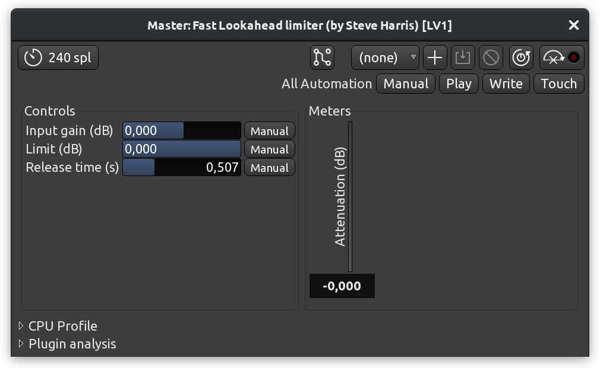

+++
title = "Dynamics"
chapter = false
weight = 6
+++

One of the problems you may encounter in a mix is that, depending on the
material, the loud parts are too loud, and/or the quiet parts are too quiet.

This kind of problem cannot be easily solved using faders to adjust the levels
alone. You may set the levels so high that they clip, or you may add unwanted
background noise by simply turning levels up. These are all problems with what
is called the _dynamic range_, i.e., the difference between the loudest and
quietest parts of your session. There are several types of tools for adjusting
the dynamic range available mostly as third-party plugins within Ardour,
including _limiting_, _compression_, and _gating_.

## Limiting

A _limiter_ is a tool that prevents the volume of a track from going over a
certain level, usually the peak level (0dB) or something close to it. Many
limiters have the option to boost the levels of the incoming signal before they
are limited, and in this way you can "close the gap" between the loudest and
quietest parts of your mix. A limiter can be used on the _Master_ bus to prevent
the overall mix from clipping. Limiters are almost always used post-fader.

In the example below, a plugin named _Fast Lookahead Limiter_ is used (if you
don't find that specific one among your installed plugins, look for any other
called "Limiter"). To set how much it limits, simply adjust the _Limit (dB)_
slider. The _Fast Lookahead Limiter_ literally looks ahead in the signal by a
few milliseconds, and when it sees that the signal is about to go over the limit
you have set, it automatically turns the levels down.

The _Input Gain (dB)_ slider determines how much the levels are increased before
they reach the limiter, and the _Attenuation (dB)_ meter on the right-hand side
shows how much the levels are being reduced at any given moment. While the
reduction in volume is nearly-instantaneous, the _Release time (s)_ slider
determines how long it takes the limiter to return to 0dB of _Attenuation_.

Note that the "harder" one drives the limiter (by increasing the input gain
and/or decreasing the maximum peak limit allowed), the more reduction the
limiter is forced to make, and the more likely it is that artifacts of the
processing will occur (such as distortions or erratic changes in volume). On
the _Master_ bus, it is generally best to avoid excessive limiting.

## Compression

A _compressor_ boosts the overall volume of a sound, but then "squeezes" it
depending on how loud it is. This can make vocals sound more even or drums
sound fuller and louder. The end effect is similar to how a limiter can reduce
the range between the quietest and the loudest sound, however the effect is
more selective when using a compressor.

A typical compressor will have these obligatory controls:

**Threshold**
: Sets the level at which the compressor will start to act.

**Ratio**
: Controls how much the compressor will "squeeze" the sound.

**Attack** and **Release**
: Control how quickly the compressor affects the sound.

The _ACE Compressor_ plugin on the screenshot above has two additional controls:

**Threshold level** (in dB)
: Sets the level at which the compressor will compress or squeeze the sound.

**Makeup gain** (in dB)
: Boosts the whole signal after the compression occurs.

To soften out a vocal, for example, you could set _Threshold level_ of −10dB or
so and a _Ratio_ of 2.5, and then bring the volume back up with the _Makeup
gain_. The other three controls — _Attack time_, _Release time_, and _Knee_ —
allow you to control the shape of the compression.

For soft vocal compression, you would want a semi-fast attack time so that the
compressor catches the beginning of each word, a slower release time to let the
voice ring out, and a soft knee radius to create a gentle form of compression
that isn't too noticeable.

If you want to make drums sound big, you might try a slow attack time so that
you don't compress the pop of the drum, a fast release time so that the
compressor can catch the next hit of the drum, and a large ratio to make the
dynamics between the beginning and end of the drum hit similar.

Below is a screenshot of a similar compressor from the [LSP plugins
suite](https://lsp-plug.in/):

If you want to speed up learning how to use a compressor, a generally good idea
is to insert one scope visualization plugin before the compressor and one right
after, then open both 

## Gating

The simplest kind of a _gate_ allows a signal to pass through when it is over a
certain level, and blocks the signal when it is lower than that.

Gates are often used as a kind of noise reduction. For example, the gate on a
microphone channel might only open while the singer is singing, preventing other
background noises from coming through as well when she is not singing. Gated
drums are also a very well-known studio production trick to make them sound
"sharper".

Here, the _Hard Gate_ plugin (from a suite of LADSPA plugins called
[CMT](https://www.ladspa.org/cmt/overview.html)) displays a single control
parameter, the _Threshold_ at which the gate will open and let the signal
through.

Other kinds of gates, such as the _LSP Gate_ plugin on the screenshot below, are
more complex. They have independent control over how quickly the gate opens
(_Attack_) and closes (_Release_), as well as other parameters quite similar to
those described for the SC Compressor above.

## Continuing

Now that we've explored some tools for getting the dynamic range exactly where
you want it, it's time to look at adjusting the balance of frequencies present
in each individual track and in your overall mix. In the next chapter, we'll
learn how to use the equalizer to do just that.

Next: [EQUALIZING](../equalizing)
