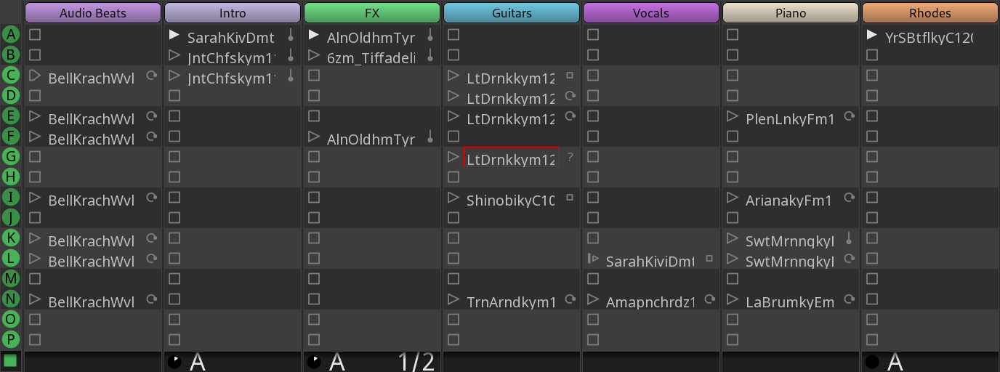







La fenêtre Cue fournit des outils pour le séquençage non linéaire, qui vous permettent de déclencher la lecture de courts clips audio et MIDI répétables.

## Organisation de l'interface utilisateur

La partie principale de la fenêtre Cue est une grille de clips regroupés par pistes et cues.

Les pistes sont disposées verticalement et regroupent généralement des clips contenant le même type d'instrument. Vous pouvez avoir une piste pour les lignes de basse, une piste pour la batterie, une piste pour les progressions d'accords de synthétiseur, etc. Vous pouvez enregistrer de nouveaux éléments sur ces pistes, puis les couper et les charger dans le séquenceur de cues. Mais tant qu'une piste est visible dans la fenêtre cues, ces éléments ne seront pas lus. Un seul clip d'une piste peut être lu à la fois.

Les cues, cependant, sont disposées horizontalement et organisent les clips qui doivent commencer à être lus en même temps.

Une structure assez courante consiste à avoir un instrument qui joue 4 mesures d'intro dans le premier cue, puis un clip avec une variation de cette mélodie dans le deuxième cue, plus la section rythmique. Dans le troisième cue, vous pouvez légèrement modifier la boucle de batterie et la ligne de basse, et éventuellement ajouter des voix.

## Comment fonctionne le séquenceur non linéaire

La nature non linéaire des repères entre en jeu lorsque vous programmez le séquenceur pour lire un clip un certain nombre de fois, puis déclencher automatiquement la lecture d'un autre clip dans cette piste. Le transport continue donc de fonctionner, mais le séquenceur passe d'un clip à l'autre.

##  Slots de déclenchement / clips

La cellule de la grille qui contient un clip est appelée slot de déclenchement. Elle est ainsi nommée car elle répond à un événement qui déclenche la lecture. Il s'agit généralement de l'appui sur un bouton de lecture, d'une touche sur un contrôleur MIDI ou d'une commande dans le séquenceur.

Les slots et les clips sont deux concepts différents. La manière dont le clip est déclenché, l'unité de grille à laquelle il est quantifié, le nombre de fois qu'un clip est lu ou le clip qui est automatiquement déclenché ensuite : tous ces paramètres appartiennent à un slot de déclenchement. C'est pratique, car si vous décidez de remplacer un clip par un autre, vous n'avez pas besoin de reconfigurer tous les paramètres.
