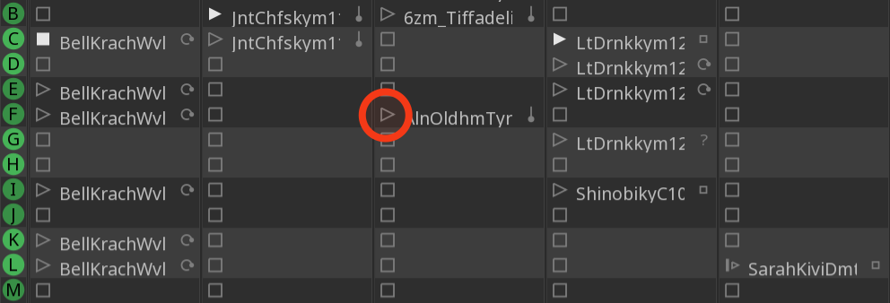
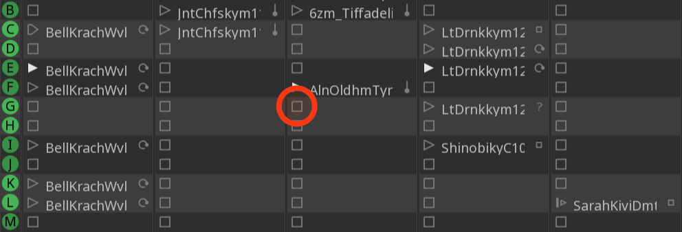
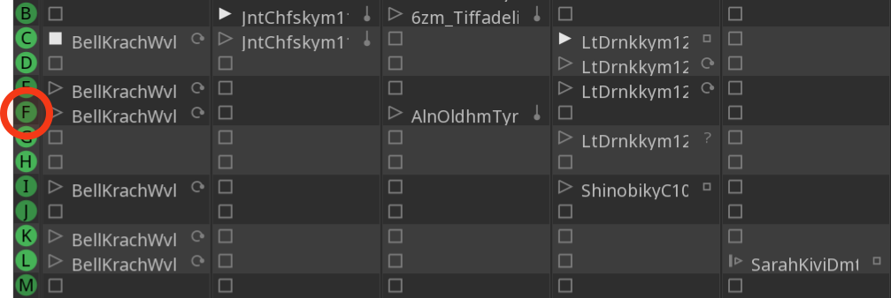
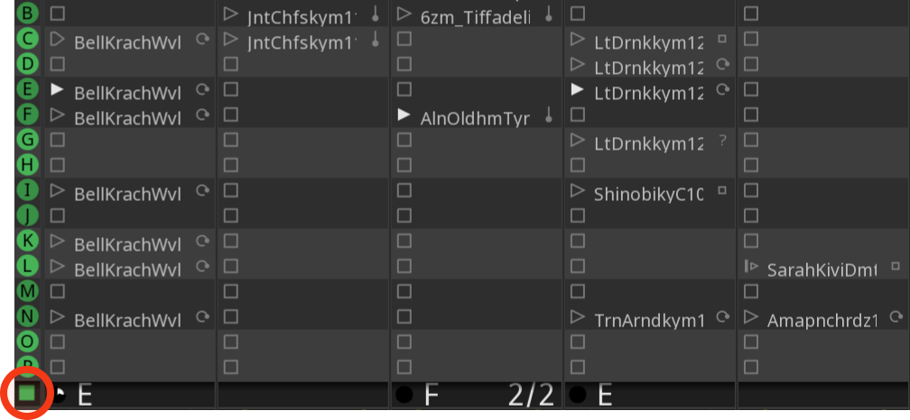







Apprenons comment démarrer et arrêter des clips individuels et des séquences entières.

## Lancer la lecture d'un clip

Pour lancer la lecture d'un clip, cliquez simplement sur le bouton avec l'icône en forme de triangle à gauche de son nom.

Le transport commencera à défiler. Une fois que la tête de lecture aura atteint l'unité de quantification suivante, qui est par défaut de 1 mesure, Ardour commencera à lire le clip. Par défaut, le clip sera lu en boucle jusqu'à ce que vous l'arrêtiez.

## Arrêter la lecture d'un clip

Il existe deux façons d'arrêter la lecture d'un seul clip :

1. Arrêtez le transport. Cela arrêtera également la lecture immédiatement.

2. Arrêtez la lecture du clip en cliquant sur n'importe quel clip vide dans la piste avec une icône carrée.

La lecture du clip s'arrêtera, mais le transport continuera.

## Lancement de la lecture d'un cue

La lecture et l'arrêt d'un cue entier fonctionnent de manière similaire. Pour lire un cue entier, cliquez sur l'en-tête du cue :

Si certains emplacements de déclenchement ont une unité de quantification de lancement plus courte ou plus longue, les clips correspondants peuvent démarrer plus tôt ou plus tard que les autres.

## Arrêter la lecture d'une Cue

Pour arrêter la lecture d'une cue, appuyez sur le bouton d'arrêt situé juste en dessous de la liste des repères.

Cela arrêtera la lecture des clips dans la cue, mais le transport continuera à fonctionner. Vous pouvez également arrêter le transport, auquel cas la lecture des clips s'arrêtera également immédiatement.
