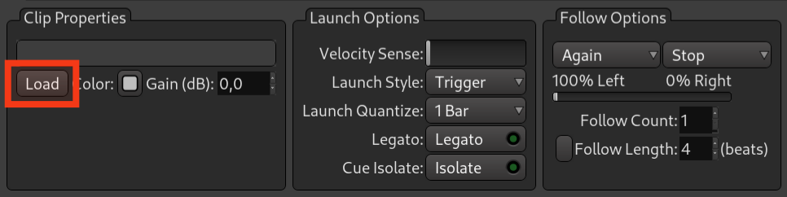
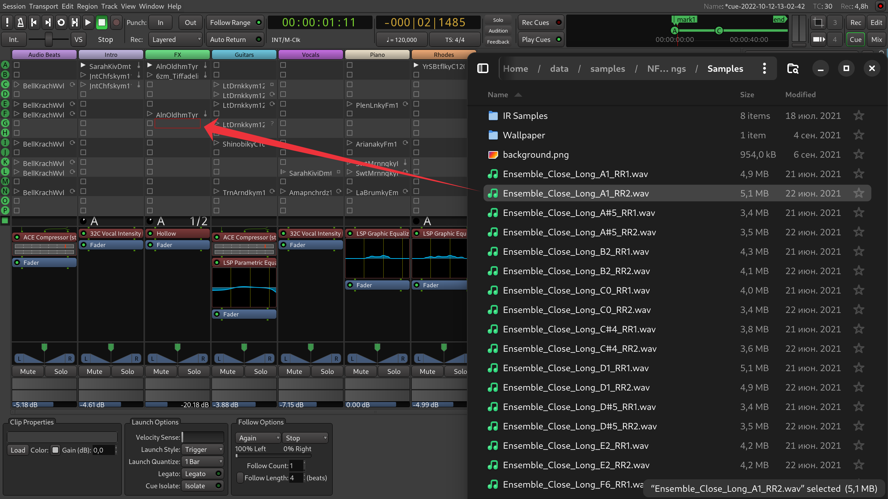
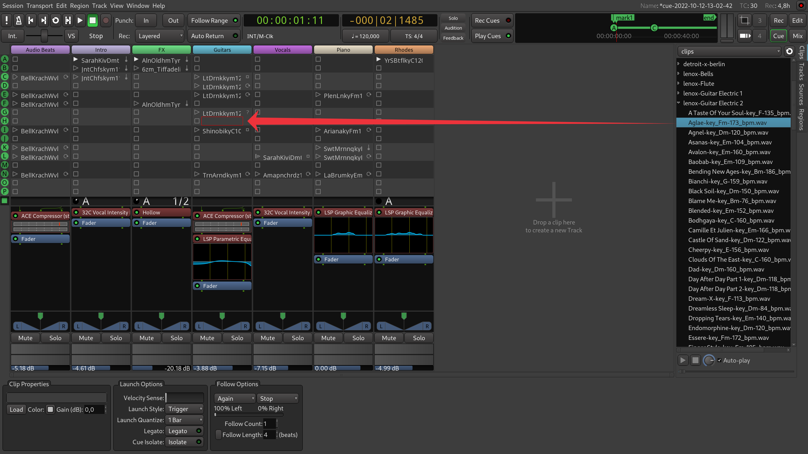
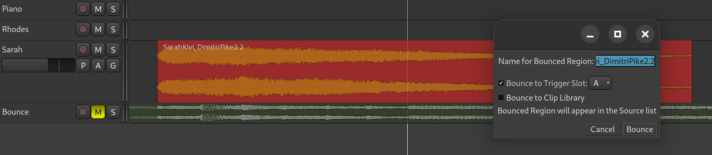







Avant de lancer un clip ou une cue, apprenons à charger des clips dans des emplacements de déclenchement. Il existe plusieurs façons de procéder.

## Charger dans la boîte de propriétés du clip

Vous pouvez sélectionner l'emplacement de déclenchement, puis cliquer sur le bouton Charger dans la boîte de propriétés du clip et indiquer à Ardour un fichier audio ou MIDI.

## Glisser-déposer à partir du gestionnaire de fichiers

Vous pouvez faire glisser un fichier audio ou MIDI arbitraire depuis un gestionnaire de fichiers vers un emplacement de déclenchement.

## Glisser-déposer depuis la barre latérale Clips

Vous pouvez glisser-déposer un clip depuis la barre latérale Clips :

## Bouncer depuis l'éditeur

Vous pouvez également bouncer une région ou une plage directement depuis l'éditeur vers un repère particulier :

Pour ce faire, cliquez avec le bouton droit sur une région et sélectionnez **Bouncer (sans traitement)**.
