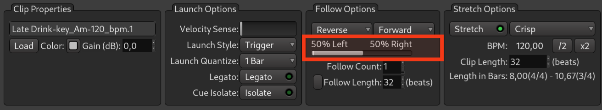
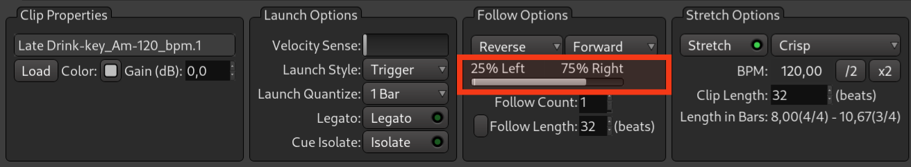
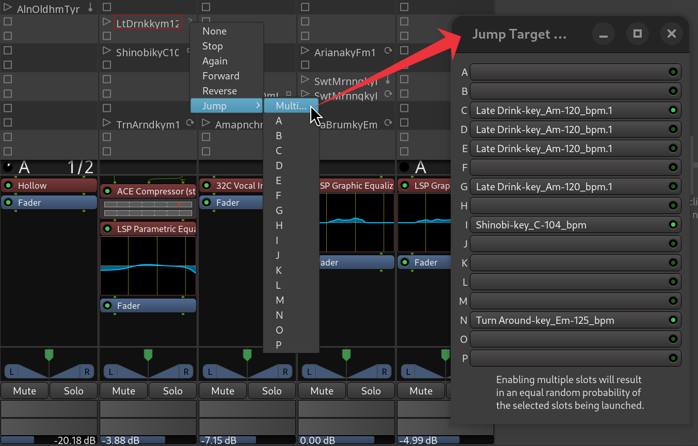







Maintenant que vous connaissez déjà les actions de suivi de base dans la fenêtre Cue, parlons de la programmation de la probabilité.

En bref, la probabilité vous permet de demander à Ardour de créer de petits accidents heureux afin d'explorer de nouvelles idées. Vous pouvez utiliser cette fonctionnalité de deux manières différentes.

<!-- FIXME SCREENSHOT -->

## Probabilité avec les actions de suivi

Tout d'abord, vous pouvez définir deux types d'actions de suivi différents pour le même emplacement de déclenchement. Supposons que l'option de gauche déclenche le clip précédent et que l'option de droite déclenche le clip suivant.

Maintenant, faites glisser ce curseur vers la droite ou faites défiler la molette de la souris pour que la deuxième option à droite ait une chance d'être utilisée.

Lorsque le curseur se trouve exactement au milieu entre les actions de gauche et de droite, ces actions ont une probabilité égale d'être utilisées une fois le clip terminé. Vous pouvez le faire glisser plus à droite pour donner à l'action de droite une meilleure chance d'être utilisée :

Vous pouvez également le faire glisser complètement vers la droite afin que l'action de gauche ne puisse en aucun cas être utilisée.

## Probabilité avec l'action Multi-Jump

La deuxième façon de programmer la probabilité consiste à utiliser l'action de suivi Multi-Jump. Sélectionnez cette action, puis activez chaque emplacement de déclenchement dans la piste qui devrait avoir une chance d'être joué de manière aléatoire.

## Probability with Multi-Jump action

The second way you can program probability is by using the Multi-Jump follow action. Select this action and then toggle each trigger slot in the track that should get a chance of being played randomly.

Chaque fois qu'Ardour a fini de lire le clip dans cet emplacement de déclenchement, il choisit au hasard l'un des emplacements que vous avez précédemment sélectionnés.