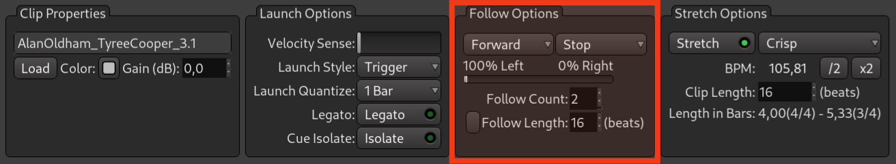
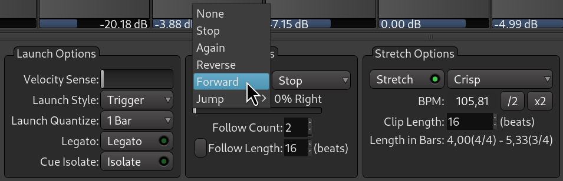
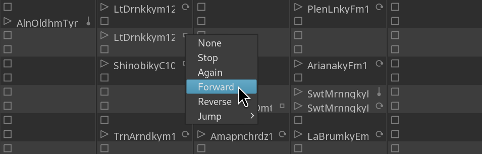







Le groupe _Options de suivi_ dans la fenêtre Cue vous permet de programmer la séquence des clips.

Un exemple simple de séquence est un clip qui lit 4 mesures d'intro dans le cue A, déclenche le clip suivant à partir du cue B qui lit huit mesures deux fois, puis déclenche le clip dans le cue D qui, après avoir lu quatre mesures quatre fois, déclenche à nouveau le clip dans le cue B, et le cycle B-à-D se répète encore et encore.

<!-- FIXME SCREENSHOT -->

On parle d'« options de suivi » car ces paramètres définissent ce qui se passe après qu'un clip a été lu une fois.

## Définition des options de suivi

Il existe plusieurs façons de définir une action de suivi.

1. Vous pouvez le faire dans la liste déroulante en bas :

2. Vous pouvez cliquer sur ce widget à droite du nom du clip et sélectionner une action :

3. Vous pouvez également sélectionner en masse une action de suivi pour l'ensemble du cue. Pour ce faire, cliquez avec le bouton droit de la souris sur le nom du cue et sélectionnez **Définir toutes les actions de suivi**.

## Actions de suivi

Le comportement par défaut consiste à lire le même clip en boucle jusqu'à ce que l'utilisateur déclenche un autre clip dans cette piste ou arrête la lecture. Cette action est appelée _Again_.

L'action _Reverse_ lance la lecture du clip qui se trouve dans l'emplacement précédent de la piste. Ainsi, une fois qu'un clip dans Cue D a été lu un certain nombre de fois, Ardour déclenche le clip dans Cue C.

L'action « Forward » fait l'inverse et déclenche le clip dans l'emplacement suivant. Ainsi, à partir d'un clip dans Cue D, vous passerez au clip dans Cue E.

Vous pouvez utiliser l'action « Jump » pour sauter plusieurs repères vers l'avant ou vers l'arrière et aller directement au repère de votre choix. Vous pouvez donc passer de Cue F à Cue M, puis de Cue M à Cue B.

L'option _Follow Count_ vous permet de définir le nombre de fois qu'un clip est lu avant qu'il ne s'arrête ou ne déclenche un autre clip dans la piste. Vous pouvez également contrôler la partie du clip original qui est lue. Pour ce faire, activez ce bouton et modifiez le nombre de battements qu'Ardour jouera à partir du clip dans l'emplacement de déclenchement sélectionné.

L'option _Follow Count_ est également ce qui distingue l'action de suivi _None_ de l'action de suivi _Stop_.

Si vous souhaitez qu'un clip soit lu un certain nombre de fois avant de s'arrêter, choisissez l'action « Stop ».

Mais si vous souhaitez temporairement supprimer le nombre de répétitions sélectionné, ignorer la durée personnalisée du clip et simplement arrêter la lecture après une seule fois, sélectionnez l'action de suivi « None ».