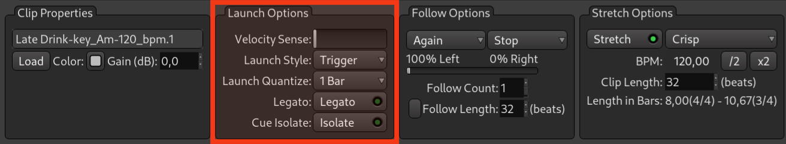







Ardour propose plusieurs options qui définissent comment un clip est déclenché, quand il commence à être lu après avoir été déclenché, et s'il répond au déclenchement de la lecture d'un cue entier auquel il appartient.

## Styles de lancement

Supposons que nous ayons une configuration par défaut où la sensibilité à la vélocité est réglée sur zéro, le style de lancement est réglé sur _Trigger_, l'unité de quantification du lancement est de 1 mesure, les options _Legato_ et _Cue Isolate_ sont désactivées et le transport est en cours.

<!-- FIXME SCREENSHOT -->

Lorsque vous cliquez sur le bouton de déclenchement, Ardour attendra le début de la mesure suivante et commencera à lire le clip. Dans ce cas, le bouton de déclenchement ne répondra à aucun nouveau clic ou événement MIDI qui lui sera envoyé. Et comme la sensibilité à la vélocité est réglée sur zéro et que vous utilisez une souris, le clip sera lu à son volume normal.

Mais si vous le réglez sur la valeur maximale et utilisez un contrôleur MIDI externe avec des touches sensibles à la vélocité ou des pads en silicone, le volume dépendra de la force avec laquelle vous appuyez sur la touche ou le pad.

## Quantification du lancement

Lorsque vous réglez l'unité de quantification du lancement sur 4 mesures, Ardour divise l'ensemble de la timeline en conséquence. Ainsi, si la tête de lecture se trouve à la mesure 6 et que vous venez de déclencher la lecture d'un clip, Ardour attendra la mesure 9 avant de commencer à lire le clip. Vous pouvez également utiliser des unités beaucoup plus petites, comme un seizième de mesure.

<!-- FIXME SCREENSHOT -->

Mais Trigger n'est pas le seul style de lancement.

_Re-trigger_ lancera la lecture du clip et répondra aux nouveaux clics ou événements MIDI. Lorsque vous le déclenchez à nouveau, Ardour arrêtera la lecture du clip, attendra la prochaine unité de quantification de lancement, puis jouera le clip depuis le début. Vous pouvez répéter cette opération autant de fois que vous le souhaitez.

_Gate_ jouera le clip tant que vous maintiendrez le bouton de la souris ou la touche ou le pad MIDI enfoncé.

Avec _Toggle_, il vous suffit de cliquer une fois sur le bouton de déclenchement et le clip continuera à être joué jusqu'à ce que vous cliquiez à nouveau ou que vous lui envoyiez un événement MIDI.

## Legato

Le mode Legato est utile lorsque vous passez souvent d'un clip à l'autre sur la même piste. Imaginons que vous ayez une boucle de batterie de 8 mesures. Et que vous ayez deux variations d'une boucle de ligne de basse qui font également 8 mesures chacune. Ainsi, lorsque vous êtes à deux mesures dans le nouveau cycle de répétition et que vous déclenchez la deuxième ligne de basse, sans le mode legato, votre ligne de basse recommence depuis le début et vous obtenez donc un décalage de 2 mesures, et votre boucle de batterie et votre boucle de ligne de basse ne sont plus synchronisées. Mais lorsque vous activez le mode Legato, Ardour commence à jouer la deuxième boucle de ligne de basse à partir de la troisième mesure. Ainsi, votre section rythmique sera parfaitement synchronisée.

<!-- FIXME SCREENSHOT -->

## Cue Isolate

Le mode _Cue Isolate_ est utile lorsque vous n'avez pas besoin de jouer un clip particulier lorsque vous lancez l'ensemble du cue. En général, cela est dû au fait que vous avez programmé une séquence complexe pour une certaine piste et que vous ne voulez pas qu'elle soit compromise par le lancement de cues.