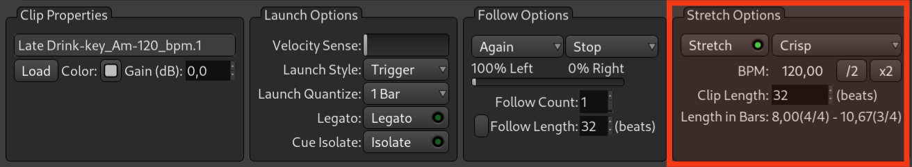







Il arrive parfois qu'une boucle de batterie que vous aimeriez vraiment utiliser dans une chanson ait un tempo plus lent ou plus rapide que celui de votre session. Les options d'étirement permettent de la synchroniser parfaitement avec le reste de la chanson.

## Comment Ardour gère le tempo des clips par défaut

Par défaut, Ardour estime le tempo réel d'un fichier audio. Ensuite, lorsque vous le lisez, il étire ou compresse ce fichier audio à la volée pour l'adapter au tempo actuel de la session. Cela fonctionne même dans le cadre d'une rampe de tempo, de sorte que le tempo du clip suivra l'accélération et la décélération.

Vous pouvez remplacer ce comportement par défaut à des fins artistiques et lire un clip à son tempo d'origine en désactivant l'étirement de ce clip dans le panneau **Options d'étirement**.

## Modifier le tempo d'un clip

Vous pouvez également modifier facilement le tempo d'un clip pour le rendre deux, quatre, huit fois plus rapide ou plus lent en cliquant sur ces deux boutons.

<!-- FIXME SCREENSHOT -->

Supposons que le tempo de votre clip original soit de 120 bpm et que le tempo de votre session soit de 140 bpm. Cela signifie que le clip ne sera joué que 14 % plus vite. Mais si vous faites en sorte qu'Ardour considère que le tempo original est de 60 bpm, Ardour devra alors compenser la différence de 80 bpm plutôt que de 20 bpm. Il jouera donc le clip plus de deux fois plus vite.

Vous pouvez augmenter ou diminuer le tempo du clip par petits paliers en modifiant le nombre de battements dans lesquels ce clip est mesuré. Ainsi, si vous voulez que ce clip soit joué en 14 mesures, son nouveau tempo supposé sera de 105 bpm.

<!-- FIXME SCREENSHOT -->

## Material-specific options

You can’t stretch or compress drum loops and piano loops the same way, so Ardour provides three options.

<!-- FIXME SCREENSHOT -->

- The _Crisp_ preset works best with drum loops and other material where you have fast attack, high decay, and then fast sustain and release.
- The _Smooth_ preset works best with long sustained notes that have a slow attack, like a synth pad or bowed strings.
- And the _Mixed_ preset is for something between those two cases, like vocals or piano chords.

## Options spécifiques au matériel

Vous ne pouvez pas étirer ou compresser les boucles de batterie et les boucles de piano de la même manière, c'est pourquoi Ardour propose trois options.

<!-- FIXME SCREENSHOT -->

- Le préréglage _Crisp_ fonctionne mieux avec les boucles de batterie et autres matériels où vous avez une attaque rapide, un déclin élevé, puis un sustain et un relâchement rapides.
- Le préréglage _Smooth_ fonctionne mieux avec les notes longues et soutenues qui ont une attaque lente, comme un pad de synthé ou des cordes frottées.
- Et le préréglage _Mixed_ est destiné à quelque chose entre ces deux cas, comme les voix ou les accords de piano.
