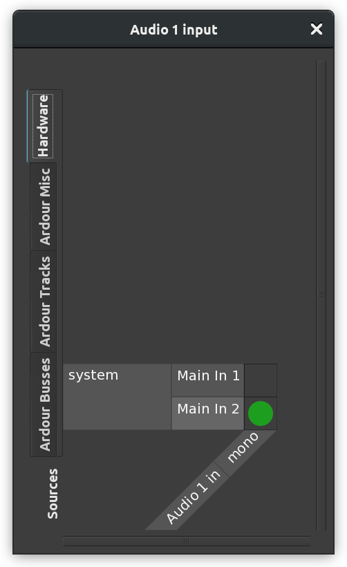

+++
title = "Recording audio"
description = "How to record audio with Ardour"
chapter = false
weight = 1
+++

Besides importing existing audio files, another way to create regions in your
Ardour session is to *record* new audio.

The source of this audio could be the line or microphone inputs of your audio 
interface, or it could even be sound originating from other applications on
your computer which have been connected to Ardour via JACK. Please see the
[section on routing](../understanding-routing/) for more details.

This section will show you how to record audio from an external source (for
example, a microphone) onto a track in Ardour.

 

First, you should check that the proper inputs have been routed to the
track you wish to record to.

1. Select the track by clicking on the empty space just below its name and
volume slider.
2. The track becomes highlighted.

3. The vertical _Editor Mixer_ strip located on the left side of the _Editor_
window should now show the track you just selected (*Audio 1* in the image
above).
4. Just below the track name in the _Editor Mixer_ you will find a button that
allows you to edit the routing.
5. Click on that button to investigate the routing.

{}
If you don't see the _Editor Mixer_ strip, use the **Shift + E** shortcut to
make it appear.
{}

In the next image you can see that the only input of this mono track is
receiving signal from *system capture_1*. This normally means the first
microphone input of your soundcard. The actual names of the connections on your
personal computer may be different depending on a number of factors, including
whether you are using a macOS, Windows, or Linux computer. If you don't see a
connection named *system capture_1*, look for whichever connection name is
likely to be your input microphone. 

 

The tabs that you see displayed vertically on the left are available
sources. "*Audio 1 in*" on the bottom right is the
destination. The green dot represents a connection.

The _Ardour_ tabs show the connections that can be made from other sources
within Ardour. The _Other_ tab displays audio connections available from
software other than Ardour, if any is available. The _Hardware_ tab shows
hardware connections (for example, the built-in microphone of your computer or
the inputs from your sound card). This will be explained in more detail in the
[Understanding Routing](../understanding-routing/) chapter.

For the purpose of this chapter, simply make sure that _system capture_1_ (or
equivalent in your computer) from the _Hardware_ tab is connected to the track
you want to use so that we can do a test recording. If you don't see a green dot
as in the screenshot above, click on the matrix to make the connection manually.
You can now close this window.

{}
The example above assumes you are recording a mono sound source onto a mono
track. If you want to record in stereo, the instructions are pretty much the
same, but you should create a stereo track. You should then see two green dots,
one for _capture_1_ and another for _capture_2_.
{}

### Arming the Track

{}
Please be sure to first turn down the volume of your loudspeakers before the
next step.
{}

"Arming the Track" is simply to get it ready for recording. Once you have
checked that the proper capture inputs have been routed to the Track, you can
arm the Track to record by clicking on the small red icon on the horizontal
track strip (not the big one in the Transport controls).

 

When properly armed, the small red icon will remain highlighted, and you will be
able to see the incoming signal by looking at the _peak meter_ on the _Editor
Mixer_ or on the horizontal track strip.

If you are using headphones, you should be able to hear ("monitor") the sounds
being recorded. If you are using loudspeakers, be sure to turn their volume down
to avoid feedback.

{}
Unless you have told Ardour to do otherwise, the input being recorded will be
monitored (in other words, heard) via the _Audition_ output. If you are not
using headphones to monitor the recording process, you may get some loud
feedback at this point!
{}

### Arm Ardour and Start Recording

Now that you have armed the track to record, you must arm Ardour itself to
record by clicking on the big red button in the _Transport_ toolbar. The button
will blink in red, indicating that Ardour is ready to record. To start
recording, click on the **Play** button in the _Transport_ menu, or press the
space bar of your computer keyboard. Clicking the **Play** button again (or
pressing the space bar) will stop recording.

 

While recording, the armed Track will capture the sounds from the input.
Any existing sound on other tracks will play normally during the
recording. This allows you to play, sing or speak along with other
Regions and Tracks you have already recorded or embedded in your
Session.

While recording, you will be able to see the **Levels** (the amplitude
in Decibels) of the incoming sound, as well as see the **Peaks** of the
**Waveform** appearing as it is recorded.

### Avoid Clipping

The audio in the screenshot below was recorded too loud and produced
**Clipping** (in other words, the signal recorded was outside the bounds
of what could be represented digitally), which results in a loss of
information and audible distortion. The clipped peaks in the waveform
are marked in red.

 

The best and easiest way to avoid Clipping is have some control over the
volume of the incoming audio signal before it gets to the sound card.
For example, you can can move the microphone further away from the sound
being recorded or use a mixer to reduce the volume of the incoming
signal. 

When the audio signal has been recorded within proper limits, you should
see no red Peaks, and the level meter should show a negative number as
maximum peak (for example, a maximum peak of around −3.0 Decibels allows
for a comfortable distance from the Clipping Point.)

The range of decibels between the region's maximum Peak and the Clipping
Point is commonly referred to as **Headroom**. It is common recording
practice to keep approximately three to six Decibels of Headroom between
the maximum of your signal and the Clipping Point, with the Clipping
Point itself being represented as 0dB (zero Decibels). In other words,
an audio region with a comfortable amount of Headroom would have its
maximum Peaks between −6dB and −3dB.

### Region List

Recorded audio appears as a new Region in the recording Track. Like all
Regions, this newly recorded one will be available in the Region List,
from where you can drag-and-drop it into other Tracks if needed.

The Region you just recorded will automatically receive the name of the
Track where it was recorded, with different takes being automatically
numbered. In the screenshot below, "*Audio 1-1*" and "*Audio 1-2*"
represent two different recordings made on a track named "*Audio 1*". 

You might want to plan ahead and organize your recording Session by
giving appropriate names to different tracks. For example, a Track used
only for recording vocals can be named "Voice". This way, recorded sound
files will be named accordingly, and different takes will appear in the
Regions List identified as "Voice-1", "Voice-2", etc, rather than the
default generic names, such as "Audio 1".

To rename a Track, just double-click on its name (before you arm the track to
record) and type in the new name.

 

{}
Did we mention how important it is to **save your work often**? Hit **Ctrl + S**
right now. Get in the habit of hitting it every few minutes.
{}

Continuing
----------

At this point, you may want to skip directly ahead to the [Arranging
Tracks](../../editing-sessions/arranging-tracks/) section to learn how to
arrange the regions into a composition. If you plan on doing more complicated
Recording than what we have discussed here, in particular with a multichannel
soundcard, or from other JACK-enabled audio programs on your computer, you
should also have a look at the [Understanding
Routing](../understanding-routing) chapter.

Next: [Arranging tracks](../../editing-sessions/arranging-tracks/) or
[Understanding routing](../understanding-routing)
