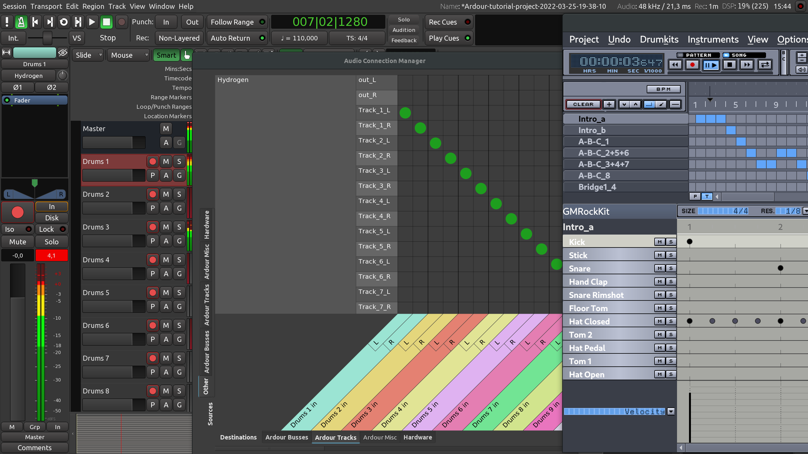

+++
title = "Routing between applications"
chapter = false
weight = 7
#pre = "<b>1. </b>"
+++

Sometimes you may need to record the audio output of another program into
Ardour, e.g. the sound of a YouTube video playing in Firefox, or the output of
SuperCollider or PureData. This chapter shows how to accomplish that.

The examples on this page were created on a computer running Ubuntu Linux.
Beware that things may work differently if you are on another OS (in particular
if you are using a Mac). The general principles are always the same, though.

### From your browser to Ardour

Web browsers (Firefox, Chromium, etc.) are not JACK-aware applications.
Fortunately, PipeWire now makes it fairly easy to connect any application that
makes sounds to any JACK-aware recording application such as Ardour.

All you have to do is launch Qjackctl, start JACK, then start making sounds in
the browser, then connect browser's outputs to a track in Ardour. You can use
either Connections or Graph windows in Qjackctl to do that, or you can do it
directly in Ardour. For that, in the Audio Connection Manager manager switch to
the _Other_ tab in _Sources_ on the left and connect your browser's output to an
Ardour track that is called _From YT_ here:



As applications like web browsers do not usually have persistent audio output
ports, you do need to make your browser output some audio for the ports to be
created. That usually means playing a video or starting a videoconference.

After that, all you have to do is arm the track for recording, then start
recording:



{}
Please make sure you disconnected all other outputs (such as a mic) from the
track's input, otherwise your track might catch more than you wanted and mix it
with the audio from your browser. 
{}

### From JACK-aware applications to Ardour

Other music software like SuperCollider, Hydrogen, and PureData are
JACK-aware. This means they will show up directly as source and
destination options in Ardour's Audio Connection Manager. You don't need
to worry about any PulseAudio / Jack bridge as in the YouTube example
above.

The procedure is essentially the same: create a mono or stereo track to
record the audio, set that track's inputs to the desired source, and
record as usual. 

 

The screenshot above was taken while recording a drum pattern from Hydrogen
directly into an Ardour tracks named _Drum N_ where N is a number from 1 to 18.
By default, Hydrogen creates a stereo output from its own mix. However you tell
it to create per-instrument output ports instead (the checkbox is on the _Audio
System_ page of the _Preferences_ dialog).

Hydrogen's window is on the right. Ardour's patchbay window was left open for
demonstration: notice that the application _Hydrogen_ shows up as a source
under the _Other_ tab. Its ports are connected directly to the inputs of the
tracks.

## Continuing

This concludes the _Recording_ chapter. Now that you have some audio imported,
recorded from a line or microphone input, or even from another application,
proceed to the _Arranging Tracks_ section and learn how to arrange your
composition.

NEXT: [ARRANGING TRACKS](../../editing-sessions/arranging-tracks/)
