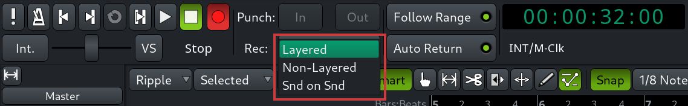
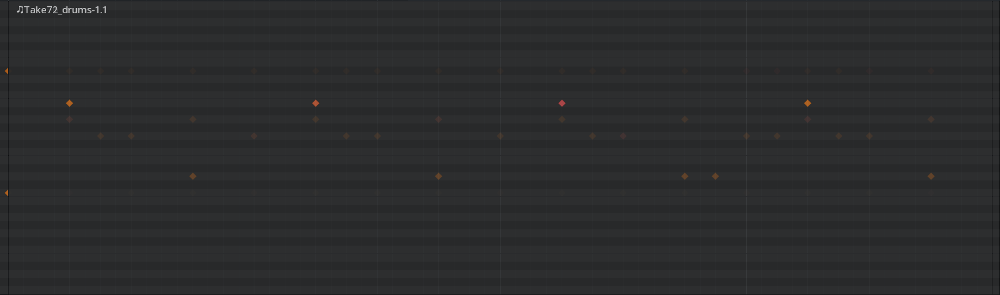

When you do overdubbing with punch in and out, all changes happen non-destructively. You do however have a choice over what Ardour does when it overdubs. For that you have three recording modes that you can select in the main toolbar.

## Layered

The _Layered_ mode is the one used by default. When you overdub in layered mode, it creates a new opaque region on top of the existing one. To illustrate that, let’s open the right-click menu above track's header and switch from the _Overlaid_ mode to the _Stacked_ mode. So when the playhead is above this new region, you only hear the sound from the top layer  and you don’t hear the sound from the bottom layer. The layered mode is the most convenient one when you do comping and you want to have easy access to multiple takes.

## Non-Layered

In the _Non-Layered_ mode, Ardour trims the existing region so that the new one fits right in. Both regions are opaque. This recording mode is best when you don’t want to preserve individual takes. If you didn’t like the take, you can still undo. Or if you made multiple changes after overdubbing and you want to undo, you can select the newer region, delete it from the timeline, and then tweak the edge of either of the two regions to reveal original audio or MIDI.

## Sound-on-Sound

When you overdub in the _Sound-on-Sound_ mode, Ardour creates a new region in a new layer at the top, but it makes this region transparent. This means that Ardour will play audio or MIDI from all takes at the same time. There are multiple uses for that. One of them is progressively building up a drum track by adding kick drum, toms, snares, and hi-hats in each individual take.

Please note that you can toggle the opacity of stacked regions at any time later. To do that, select a region, go to the main menu and use the `Region > Gain > Opaque` toggle. You can do the same in the right-click menu above the region. Or you can just press **Alt+0**.

**Continuing**

In the next chapter, we'll talk about helping yourself to perform in sync with the rest of the session material, whether you are using a MIDI keyboard to record a lead synth part or a bass guitar.
