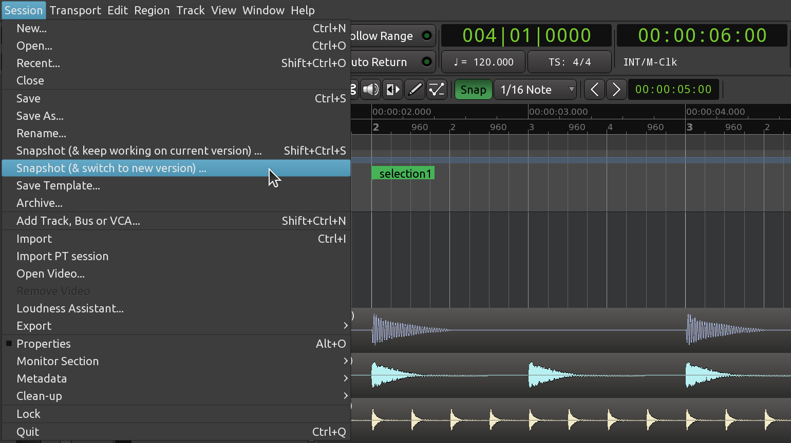
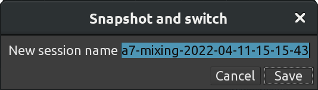
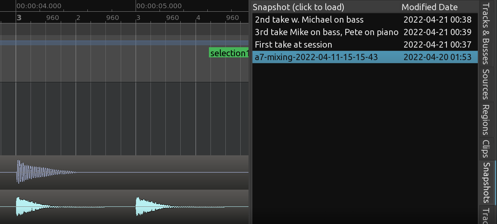

+++
title = "Saving a snapshot"
chapter = false
weight = 2
+++

A _snapshot_ is a representation of the current state of a session. In a
nutshell, it's like versioning your project by giving every version a
meaningful, descriptive name. Even though it's not really exposed to users,
every session always has at least one snapshot which is whatever you have
there at the moment.

Let's say you recorded a song in your home studio and you are trying different
arrangements to see which one works best. Instead of creating multiple sessions
and copying files between them, you can make snapshots every time you think you
have something worth preserving. At any point in time, you can save the current
state of the session and switch to an earlier snapshot to compare your
arrangements.

## Saving a Snapshot

Ardour provides two commands in the _Session_ menu to create a snapshot:

**Snapshot (& keep working on current version)**
: You will create a new snapshot and continue working on the original version.
Any new saves will overwrite the current state of the project, the newly
created snapshot will not be affected. Mental model: "I think I'm about to
change things in a major way, so I need a backup if everything goes sideways
with my experiment".

**Snapshot (& switch to new version)**
: You will create a new snapshot and switch to working on that version. Any new
saves you do will affect the new snapshot until you switch to the original
snapshot. Mental model: "This is actually quite interesting, let's explore this
idea further and get back to the previous one if this turns out to be a dead
end". 

By default the program will name the new snapshot according to the current date
and timestamp of your system. If you wish, you can change the name to one that
more meaningfully corresponds to the session you are working on.

## Recalling Snapshots

You can recall a saved snapshot via the _Snapshots_ tab in the area on the
right:

There you see a few snapshots that we created, and the _my\_session_ entry
represents the original state of our session.

Click on any snapshot from the list to reload it.

## Continuing

Sometimes it is helpful to have a default starting point for new sessions, for
example, for a setup that you use all the time when starting a new project. To
learn how to do this, please continue to the next section called _Saving a
Template_. 

Next: [SAVING A TEMPLATE](../saving-a-template)

